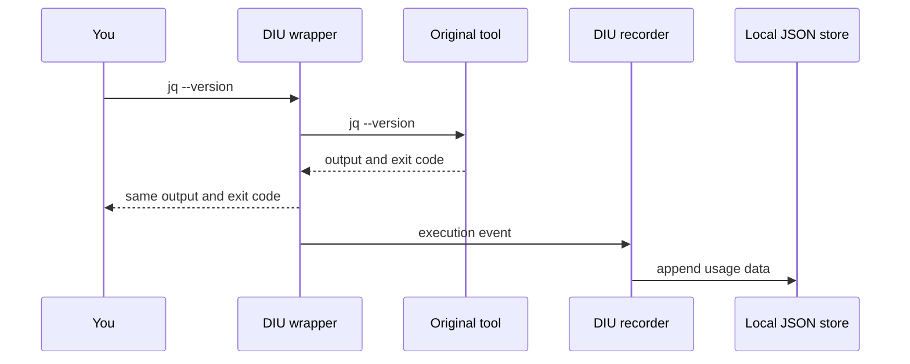
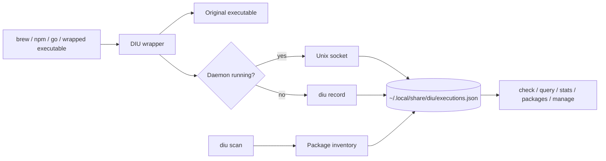

# DIU [Do I Use]

[](https://codecov.io/gh/yowainwright/diu)

> Know which global development tools you **actually** use

DIU tracks executions of global tools installed through Homebrew, npm, and Go. It keeps a small local JSON inventory so you can answer questions like:

- Did I use `jq` recently?
- Which global npm packages have I not touched in months?
- What are my most-used command-line tools?
- What would DIU uninstall before I actually run it?

DIU is macOS-first, written in Go, and uses only the Go standard library at runtime.

## Quick Start

```bash
# Install command wrappers and create local storage
diu setup

# Open a new shell so the wrapper path is active
exec "$SHELL" -l

# Scan currently installed global tools
diu scan

# Use your tools normally
jq --version
npm --version

# Ask DIU what it has seen
diu check jq
diu stats --weekly --top 5
```

## Install

```bash
# mise
mise install diu
mise use -g diu

# Homebrew
brew tap yowainwright/tap
brew install diu

# Go
go install github.com/yowainwright/diu/cmd/diu@latest
```

From source:

```bash
git clone https://github.com/yowainwright/diu
cd diu
mise run build
```

## Common Examples

Check a package:

```bash
diu check jq
```

Example output:

```text
homebrew  jq  used 12 times  last: 2026-06-20
```

Find packages that have not been used recently:

```bash
diu packages --unused 6m
diu check --unused 90d --format csv
```

Review recent executions:

```bash
diu query --last 7d --limit 10
diu query --tool npm --package eslint --format json
```

Preview an uninstall command before running it:

```bash
diu manage --uninstall jq --tool homebrew --dry-run
# brew uninstall jq
```

Uninstall after confirmation:

```bash
diu manage --uninstall jq --tool homebrew
```

Skip confirmation when scripting:

```bash
diu manage --uninstall typescript --tool npm --yes
```

## How It Works

`diu setup` installs lightweight wrappers in `~/.local/bin/diu-wrappers` and adds that directory to existing shell config files when possible. The wrapper runs the original command, preserves its output and exit code, then records the execution in the background.



The daemon is optional. When it is running, wrappers send events to a local Unix socket. When it is not running, wrappers fall back to `diu record`.



## Commands

| Command | Use it for |
| --- | --- |
| `diu setup` | Create config, storage, shell path entries, and wrappers. |
| `diu scan` | Refresh the known package inventory. |
| `diu check [search]` | Search tracked packages and see usage. |
| `diu packages` | List tracked packages, optionally filtered by tool or unused duration. |
| `diu query` | Show recorded executions. |
| `diu stats` | Summarize usage by time range, tool, and top packages. |
| `diu manage` | Search packages and uninstall them interactively or by flag. |
| `diu daemon start` | Start the optional local recorder/API daemon. |
| `diu config list` | Print the resolved config as JSON. |
| `diu cleanup` | Apply retention and storage limits. |
| `diu backup` | Create a manual JSON storage backup. |

Useful filters:

```bash
diu check rip --tool homebrew --limit 5
diu packages --tool npm
diu packages --unused 30d
diu query --tool go --last 24h --format csv
diu stats --daily
diu stats --tool homebrew --top 20
```

## Local API

Start the daemon:

```bash
diu daemon start
```

Default base URL:

```text
http://127.0.0.1:8081/api/v1
```

Examples:

```bash
curl http://127.0.0.1:8081/api/v1/health
curl "http://127.0.0.1:8081/api/v1/executions?tool=homebrew&limit=10"
curl "http://127.0.0.1:8081/api/v1/packages?tool=npm"
curl http://127.0.0.1:8081/api/v1/stats
```

Record an event manually:

```bash
curl -X POST http://127.0.0.1:8081/api/v1/executions \
  -H "Content-Type: application/json" \
  -d '{
    "tool": "npm",
    "command": "npm install express",
    "args": ["install", "express"],
    "exit_code": 0,
    "duration_ms": 5432,
    "user": "jeff"
  }'
```

## Files

| Path | Purpose |
| --- | --- |
| `~/.config/diu/config.json` | User config. |
| `~/.local/share/diu/executions.json` | Execution history, package inventory, and stats. |
| `~/.local/share/diu/diu.pid` | Daemon PID file. |
| `~/.local/share/diu/diu.sock` | Daemon Unix socket. |
| `~/.local/bin/diu-wrappers` | Generated command wrappers. |

Common config edits:

```bash
diu config get storage.json_file
diu config set storage.retention_days 180
diu config set monitoring.enabled_tools homebrew,npm,go
diu config list
```

## Troubleshooting

```bash
# The wrapper path is not active in this shell
exec "$SHELL" -l

# Rebuild wrappers after installing new global tools
diu setup
diu scan

# Check daemon state
diu daemon status

# Run the daemon in the foreground for logs
DIU_DAEMON_FOREGROUND=1 diu daemon start
```

## Development

```bash
mise install
mise run setup
mise run test
mise run build
```

Release checks:

```bash
gofmt -w cmd internal pkg scripts e2e
go test ./...
go test -race ./...
go vet ./...
golangci-lint run ./...
goreleaser check
```

## Requirements

- macOS 10.15 or later
- Go 1.25+ when building from source

## License

MIT

## Author

Jeffry Wainwright ([@yowainwright](https://github.com/yowainwright))
